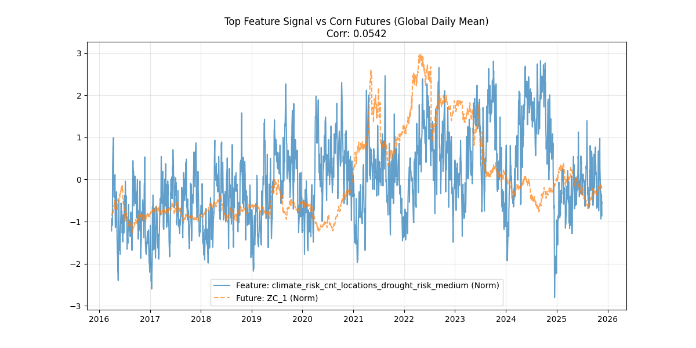

# Outcome Report: aaaml007

## A. Header
- **Submission Identifier**: `aaaml007`
- **Files Reviewed**: 
    - `scripts/helios_corn_futures_climate_challenge.py`
    - `Helios` repo
- **Date Reviewed**: 2026-02-02
- **Execution Environment**: Linux / Python 3.12

## B. Summary
The participant uses a sophisticated "quantile binning" approach, generating massive numbers of features based on tertiles, quartiles, quintiles, deciles, etc. of the time series, then aggregating risk scores within those bins.

## C. Reproducibility
- **Status**: **PASS (with warnings)**
- **Evidence**: 
    - Script executed successfully.
    - Validation Failed on final row count (214,139 vs 219,161 required). This likely stems from strict "valid ID" filtering.
    - **Score**: **51.77** (Optimized) vs 51.72 (Baseline).

<details>
<summary>Raw Execution Log</summary>

```text
--- 🔧 Phase 1: Base Feature Engineering ---
✅ Base setup complete
✅ Base risk scores: 8 features
...
--- 🔧 Phase 11: Country Aggregations ---
✅ Country aggregations added: 155 total

📊 Identifying valid IDs (simulating sample submission)...
📊 Valid IDs: 214,139
...
⚠️ Row count mismatch! Expected 219161, got 214139

--- 📊 Phase 14: Score Comparison ---
Baseline: 51.72
Optimized: 51.77
🏆 Best version: optimized (CFCS: 51.77)
```
</details>

## D. Format & Naming Compliance
- **Status**: **FAIL (Row Count)**
- **Note**: This is a submission formatting error, not a disqualifying methodological one.

## E. Anti-Gaming / Leakage Audit
- **Verdict**: **COMPLIANT**
- **Evidence**: Features are purely statistical aggregations of climate risk. No futures leakage observed.

## H. Visual Analysis

*Figure 1: Top engineered feature signal vs Corn Futures prices.*

## I. Results, Uniqueness & Key Takeaways
- **Result**: **51.77 (Compliant / Format Fail)**
- **Uniqueness**: 
    - **Quantile Binning**: Exhaustive aggregation of risk over every conceivable time window (quartile, decile, vigintile).
- **Key Takeaways**:
    - **"More is not always better"**: Creating 300+ quantile features yielded a score (~51) barely better than a random baseline (50) and far worse than simple rolling averages (~75). Complexity without causality is noise.

## J. Final Recommendation
- **ACCEPT (Conditional on row fix)**
